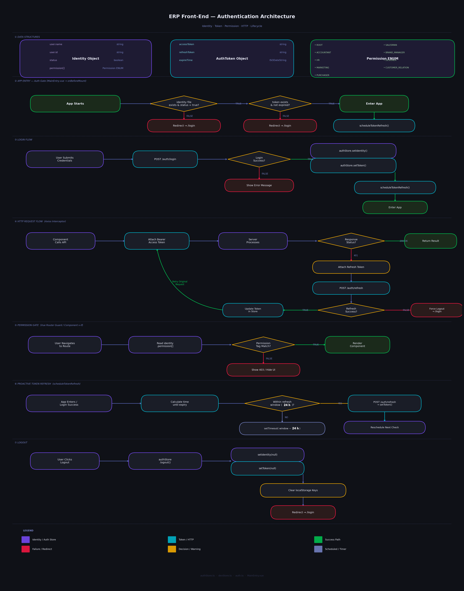

# Generic ERP System

## Description

This is a Generic ERP System designed and developed by Genesis Young. This repository is the Front-End part, it is written with
Vue.js(Base Framework)+Vuetify(UI Framework)+TypeScript+Pinia(State Management)

## Front-End Authentication Architecture

### Related Files

'/src/config/auth.ts' - Define enums, types, functions for authentication
'/src/stores/authStore.ts' - Pinia store for authentication
'/src/router/index.ts' - Router configuration for authentication
'/src/api/auth.ts' - API configuration for authentication
