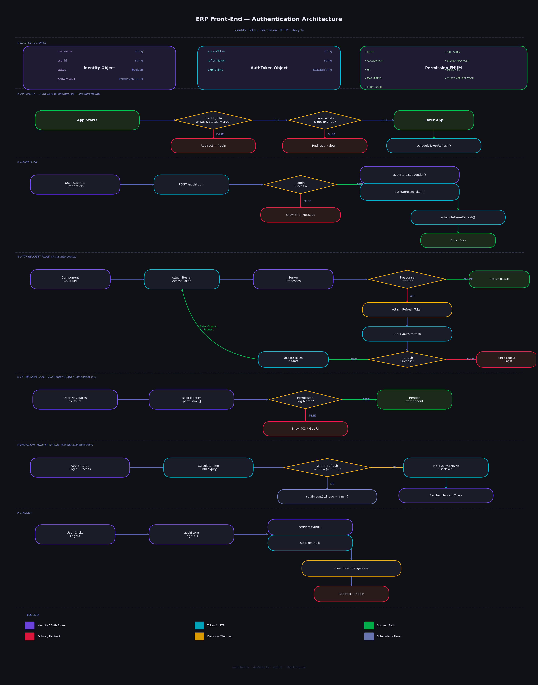

# Generic ERP — Frontend

The frontend of the **Generic ERP System**, designed and developed by Genesis Young. A Vue 3 single-page application that communicates exclusively with the [`generic_erp`](../generic_erp) Spring Boot backend via a JSON REST API. It provides a complete authentication shell, a permission-gated navigation sidebar, a multi-tab workspace UI, and management modules for users, roles, and permissions — with further ERP modules (products, inventory, customers, suppliers, reports) scaffolded in the navigation structure.

> The application lives in the [`app/`](app) directory. See [app/README.md](app/README.md) for detailed developer documentation and [DEVELOPMENT.md](DEVELOPMENT.md) for the development process document and roadmap.

## Tech Stack

| Layer | Technology |
|---|---|
| Framework | Vue 3 (Composition API) |
| Language | TypeScript (strict, `noUncheckedIndexedAccess`) |
| Build | Vite |
| UI | Vuetify 4 + Material Design Icons |
| State | Pinia + pinia-plugin-persistedstate |
| Routing | Vue Router 5 (hash history) |
| HTTP | Axios with JWT / auto-refresh interceptors |
| Charts | Apache ECharts via vue-echarts |
| Testing | Vitest + @vue/test-utils |
| Linting | Oxlint + ESLint + Prettier |

## Quick Start

**Prerequisites:** Node.js `^20.19.0` or `>=22.12.0`, plus the `generic_erp` backend running locally.

```bash
cd app
npm install
npm run dev        # Vite dev server at http://localhost:5173
```

Create `app/.env.local`:

```env
VITE_BASE_URL=http://localhost:8080   # backend API origin (required)

# Optional — skip login during local development:
VITE_APP_DEV_MODE=true
```

### Common Commands

```bash
npm run build        # type-check + production build (outputs to app/dist/)
npm run type-check   # vue-tsc only
npm run test:unit    # Vitest unit tests
npm run lint         # oxlint then eslint (both auto-fix)
npm run format       # prettier over src/
```

## Authentication Architecture



Authentication is JWT-based:

1. `LoginView` calls `POST /api/auth/login`; the returned access/refresh token pair and identity are stored in the Pinia auth store (`src/stores/auth.ts`) and persisted to `localStorage`.
2. The Axios instance (`src/api/http.ts`) attaches `Authorization: Bearer <token>` to every request.
3. On a `401`, the interceptor silently exchanges the refresh token for a new access token and retries the original request. Concurrent failing requests are queued and replayed together after the refresh; if the refresh itself fails, the user is logged out and redirected to `/login`.
4. A router `beforeEach` guard enforces `meta.requiresAuth` on protected routes; the sidebar menu is fetched from `GET /api/users/fetch/sidebar/menu` and filtered by permission.

**Related files:** `src/assets/config/auth.ts` (Permission enum & auth types), `src/stores/auth.ts` (auth store), `src/router/index.ts` (auth guard), `src/api/http.ts` (Axios interceptors).

## Permissions

Numeric role codes defined in `src/assets/config/auth.ts`:

```ts
enum Permission {
  ROOT = 1001,
  ACCOUNTANT = 1002,
  HR = 1003,
  MARKETING = 1004,
  PURCHASER = 1005,
  SALESMAN = 1006,
  BRAND_MANAGER = 1007,
  DESIGNER = 1008,
  CUSTOMER_RELATION = 1009,
}
```

Routes under `/manage/*` currently require `Permission.ROOT`.

## Project Structure

```
app/src/
├── api/               # Axios instance (JWT + refresh interceptors), typed API calls
├── assets/
│   ├── config/        # Permission enum, sidebar navigation definitions
│   ├── components/    # AppNavigation, PaginationBar, TabMenu
│   └── styles/
├── lang/              # i18n string maps: English (us_en) & Chinese (china_zh)
├── router/            # Root router + auth guard; module routes under file/
├── stores/            # Pinia stores: auth, tabs
├── theme/             # Vuetify theme definitions (default: dark, violet primary)
├── types/             # Shared TypeScript types
└── views/
    ├── auth/          # LoginView
    ├── home/          # ManagerView dashboard
    └── manage/        # UserManage, RoleManage, RoleList, RoleDistribute, PermissionManage
```

## Features

- **i18n** — English and Simplified Chinese string maps, delivered via `provide`/`inject`; navigation labels use i18n keys for runtime language switching.
- **Multi-tab workspace** — open pages are tracked as tabs (`stores/tabs.ts` + `TabMenu.vue`); switching tabs drives the router.
- **Backend-driven sidebar** — menu items fetched from the API and merged with local config.
- **Theming** — dark theme by default with violet (`#7C3AED`) primary; typed `Theme` interface for easy extension.
- **Charts** — ECharts registered globally, ready for dashboard and report views.

## Code Conventions

- Path alias `@/` maps to `app/src/` — use it for all internal imports.
- No semicolons, single quotes, 100-char lines, 2-space indent (enforced by Prettier).
- Pinia stores use the Composition API `setup` style.
- Dual-layer linting: Oxlint (fast, Rust-based) first, then ESLint for Vue/TS rules.
